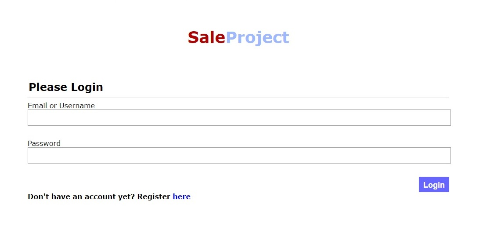

# SaleProject
Easy-buy~Easy-sell Online Store
------
Online store sudah ada dimana-mana. Masyarakat dapat membeli barang dari rumah dengan hanya bermodalkan komputer atau smartphone. Para penjual dapat melakukan bisnis online store dengan mudah. Cukup foto, tambahkan deskripsi kemudian upload.

Namun, biasanya pada online store pembeli dan penjual memiliki tipe akun yang berbeda. Jika seorang penjual ingin membeli barang, dia harus logout akun penjual, kemudian login ke akun pembeli. Artinya dia harus punya 2 akun.

Hal tersebut tidak perlu dilakukan pada **SaleProject**. Pembeli dan penjual hanya perlu memiliki satu akun. Pengguna yang sudah memiliki akun dapat melakukan pembelian dan penjualan dengan sangat mudah.

### Login

Ketika Anda mengakses web SaleProject, Anda akan langsung diarahkan pada login page. Cukup masukan username atau email serta password Anda, klik tombol login kemudian nikmati kemudahan melakukan transaksi online.

Jika Anda belum memiliki akun, ada akses mudah untuk melakukan registrasi pada bagian bawah page.

### Register

Registrasikan diri Anda dengan mudah untuk menjadi pengguna layanan online shopping **SaleProject**.
Cukup isi data2 yang diperlukan, klik tombol register dan Anda akan langsung diarahkan ke halaman *Catalog* untuk mulai berbelanja atau berjualan.

Perlu diingat bahwa Anda harus memasukkan data dengan benar karena akan divalidasi terlebih dahulu.

### Catalog

Pada halaman utama ini, Anda akan disuguhkan dengan produk-produk terbaru yang dijual di **SaleProject**.
Scroll kebawah untuk melihat-lihat produk yang sedang dijual.
Lakukan pencarian dengan mudah menggunakan search bar di bagian atas halaman. Pencarian dapat dilakukan berdasarkan produk yang dijual maupun user yang menjual.
Beri tahu pengguna lain bahwa suatu produk adalah produk yang bagus dengan cara menekan tombol Like.
Setelah menemukan produk yang diinginkan, cukup tekan tombol Buy untuk melakukan pembelian.

### Confirmation Purchase

Untuk menyelesaikan transaksi, Anda harus mengisi form pembelian seperti di atas. Sistem sudah membantu Anda dengan mengisikan data diri Anda sebagai tujuan pengiriman. Namun, jika Anda ingin mengirimkan barang tersebut pada orang lain, Anda cukup mengganti data tersebut dengan data orang yang akan dikirimkan.
Jangan lupa mengisikan nomor kartu kredit anda dan verifikasinya. Setelah selesai, klik tombol *Confirm*, klik *OK* dan transaksi pun akan langsung diproses.

### Your Products

Anda dapat melihat produk-produk yang telah Anda jual disini. Semua data tentang nama, harga deskripsi serta jumlah like dan pembelian ada disini.
Jika Anda ingin mengganti nama, deskripsi, harga ataupun gambar, cukup klik tombol *Edit*.
Jika Anda sudah tidak ingin menjual suatu barang, cukup klik tombol *Delete* dan konfirmasi penghapusan.

### Add Product

Halaman yang paling disukai penjual, yaitu halaman untuk menambahkan barang jualan.
Anda cukup mengisikan data-data barang yang akan dijual, klik tombol *Add* kemudian barang akan ditampilkan pada *Catalog* serta dapat dicari menggunakan *search*.

### Edit Product

Halaman untuk mengubah data barang yang dijual. Sistem membantu dengan mengisikan data barang tersebut terlebih dahulu untuk selanjutnya diubah.
Setelah selesai cukup klik tombol *Update* kemudian data pun akan diperbarui.

### Sales

Pada halaman ini, Anda dapat melihat barang-barang yang sudah pernah Anda beli lengkap dengan data pengirimannya.
Fitur ini akan sangat membantu Anda jika Anda ingin membeli barang yang sama namun lupa nama atau penjualnya.
Anda juga dapat membandingkan harga atau gambar dengan produk yang sudah diperbarui karena data disini disimpan berdasarkan waktu pembelian Anda dan tidak terpengaruh walaupun penjual melakukan *edit* atau *delete*.

### Purchases

Sebagai penjual, mungkin Anda penasaran siapa saja yang membeli produk Anda. Pada halaman ini, Anda dapat melihat data-data penjualan Anda lengkap dengan pembelinya dan diurutkan dari transaksi paling baru.

### Pembagian Tugas

**Tampilan**
1. Login : 13514108
2. Register : 13514108
3. Catalog : 13514108
4. Lanjutkan ...

**Fungsionalitas**
1. Login : 13514108
2. Register : 13514108
3. Catalog : 13514108
4. database.php : 13514108
5. Lanjutkan...

## About Developers
Mahasiswa S1 Prodi Teknik Informatika Institut Teknologi Bandung

Joshua Aditya Kosasih - 13514012 - ***Betatestah***

Nikolas Wangsaputra - 13514048 - ***SimpliCty***

Michael -13514108 - ***Viniell***

